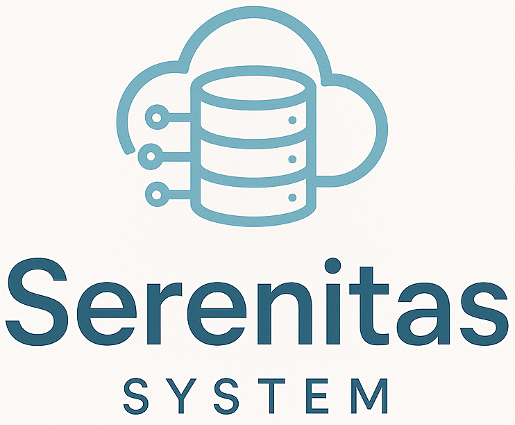
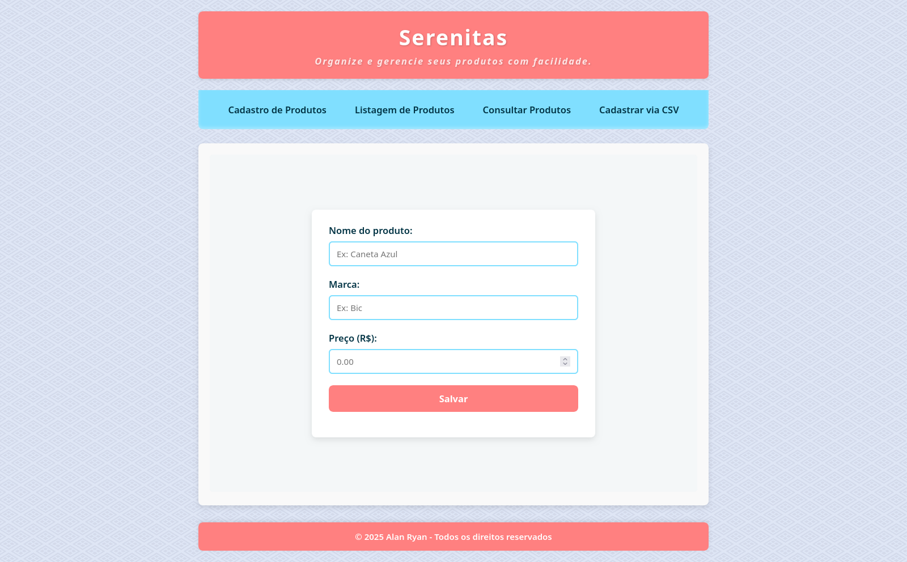
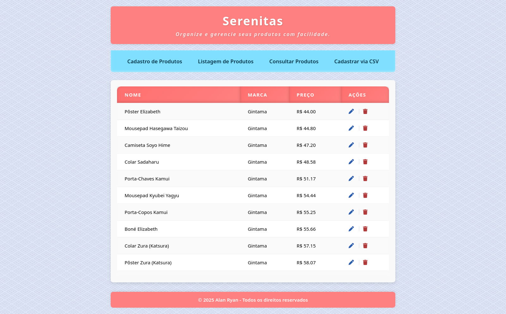
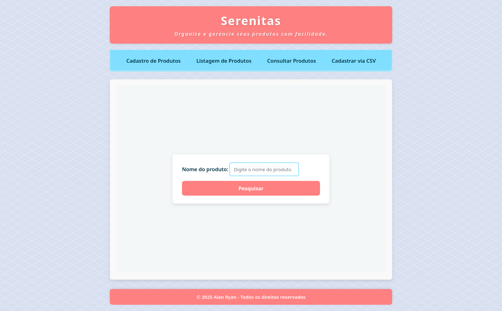
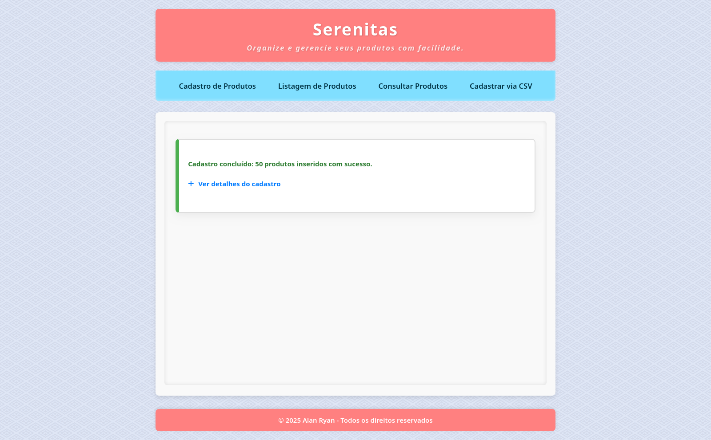
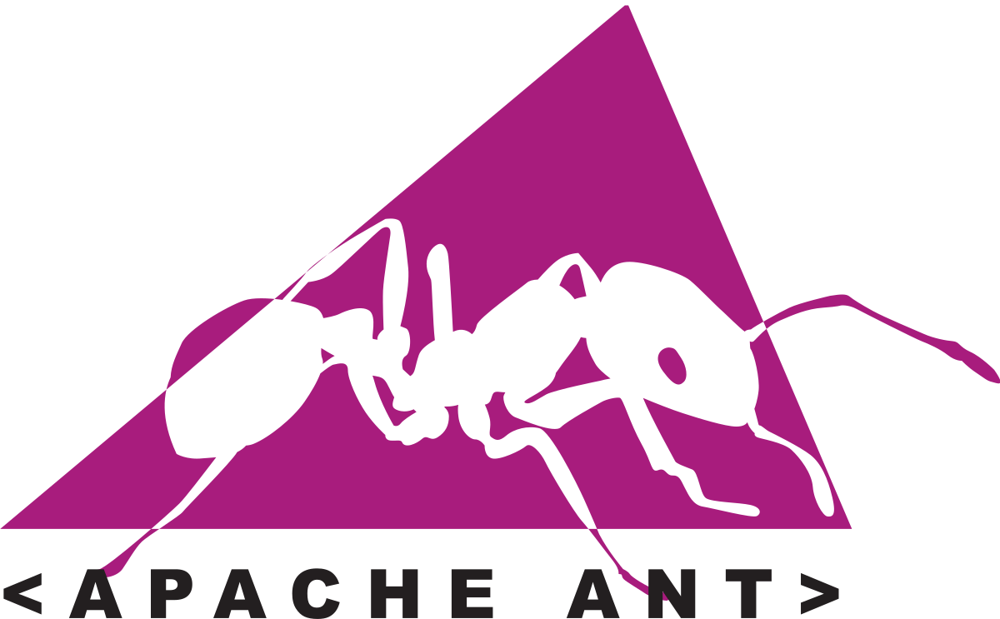
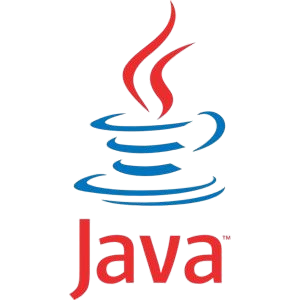
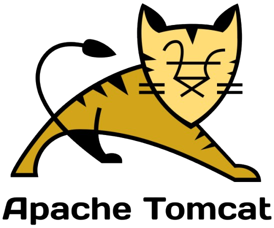

<p align="center">
  <a href="https://github.com/0nF1REy/serenitas-system" target="_blank">
    
  </a>
</p>

<div align="center">

  
  
  

<br />

  
  
  
  
  
  

</div>

## 🧭 Guia de Navegação (Índice)

- **[📖 Descrição](#descricao)** 
- **[🎯 Propósito do Projeto](#proposito)** 
- **[✨ Funcionalidades e Abordagem Técnica](#funcionalidades)** 
- **[💻 Tecnologias Utilizadas](#tecnologias)** 
- **[📸 Capturas de Tela](#capturas)** 
- **[🔧 Pré-requisitos](#requisitos)** 
- **[⚙️ Execução](#execucao)** 
- **[🌐 Acesso](#acesso)** 
- **[📁 Estrutura](#estrutura)**
- **[👤 Desenvolvedor](#desenvolvedor)**
- **[📫 Contribuir](#contribuicao)** 
- **[📜 Licença](#licenca)**

<h1 align="center">
  Serenitas System
</h1>

## 📖 Descrição <a name="descricao"></a>

O Serenitas System é um sistema web para gerenciamento de produtos e controle de estoque. Ele oferece funcionalidades essenciais como operações CRUD (Criar, Ler, Atualizar, Excluir) e importação em massa de dados via arquivos CSV. A aplicação foi desenvolvida com um stack clássico de Java para Web, utilizando JSP (JavaServer Pages) para processar a lógica de negócio e renderizar as views, com persistência de dados em MySQL via JDBC.

## 🎯 Propósito do Projeto <a name="proposito"></a>

O **Serenitas System** foi criado com um duplo propósito, servindo tanto como uma ferramenta funcional quanto como um recurso de aprendizado.

- **Como Ferramenta:** Prover uma solução web funcional e intuitiva para gerenciamento de produtos, com operações essenciais para controle de estoque.

- **Como Recurso Educacional:** Servir como um exemplo prático de uma aplicação Java Web construída com a arquitetura MVC Modelo 1, onde as páginas JSP concentram tanto a lógica de controle quanto a de apresentação. É um excelente ponto de partida para entender os fundamentos de JSP e JDBC antes de avançar para arquiteturas mais complexas como o MVC Modelo 2.

> 🏛️ **Ideal para Fins Acadêmicos e de Portfólio:** A simplicidade estrutural e a clareza do código tornam o Serenitas System uma ótima base para projetos acadêmicos e para demonstrar competências fundamentais no ecossistema Java Web.

## ✨ Funcionalidades e Abordagem Técnica <a name="funcionalidades"></a>

Este projeto implementa funcionalidades de gestão de produtos utilizando uma abordagem direta e focada nas tecnologias essenciais.

- **Operações CRUD Completas:** Implementação de todas as operações de criação, leitura, atualização e exclusão para a gestão de produtos.

- **Importação em Massa:** Funcionalidade para cadastro de múltiplos produtos de uma só vez a partir de arquivos no formato .csv.

- **Arquitetura MVC Modelo 1:** A lógica de controle e a de apresentação são centralizadas nas páginas JSP. Cada JSP é responsável por receber a requisição, processar os dados, interagir com o banco e gerar a resposta HTML.

- **Persistência com JDBC Puro:** A conexão e a manipulação do banco de dados MySQL são feitas diretamente nos JSPs utilizando a API JDBC (Java Database Connectivity) e scriptlets Java (`<% ... %>`).

- **Renderização no Servidor com JSP:** A interface de usuário é construída e renderizada dinamicamente no lado do servidor utilizando JSP.

- **Automação de Build com Apache Ant:** Utilização do Apache Ant para automatizar o processo de compilação, gerenciamento de dependências e empacotamento da aplicação em um arquivo .war.

- **Externalização de Configuração:** As credenciais do banco de dados são mantidas em um arquivo .env externo, separado do código-fonte, para maior segurança e portabilidade.

- **Deploy em Contêiner de Servlets:** O projeto é empacotado como um arquivo WAR (Web Application Archive), pronto para ser implantado em qualquer contêiner de Servlets, como o Apache Tomcat.

## 💻 Tecnologias Utilizadas <a name="tecnologias"></a>

| Tecnologia | Descrição |
|------------|-----------|
| Java 8+ (via JSP)                     | *Linguagem utilizada dentro dos JSPs (scriptlets) para a lógica de negócio.*|
| JSP (JavaServer Pages)                       | *Tecnologia central para processar requisições e renderizar as páginas web.* |
| JDBC (Java Database Conn.)   | *API nativa para conectividade com o banco de dados.* |
| MySQL                | *Banco de dados relacional para persistência de dados.*|
| Apache Tomcat                | *Contêiner de Servlets para execução da aplicação web.*|
| Apache Ant                   | *Ferramenta para automação de build e empacotamento (.war).* |

## 📸 Capturas de Tela <a name="capturas"></a>

*   ### *Apresentação:*


*   ### *Cadastro de Produtos:*



*   ### *Listagem de Produtos:*



*   ### *Consultar Produtos:*



*   ### *Cadastrar via CSV:*



## 🚀 Começando

Os seguintes softwares precisam estar instalado em seu sistema antes de você poder executar o Serenitas System:

<div align="center">

## 🔧 Pré-requisitos <a name="requisitos"></a>

<a href="https://git-scm.com/" target="_blank">
  
</a>
<a href="https://ant.apache.org/" target="_blank">
  
</a>
<a href="https://www.oracle.com/java/" target="_blank">
  
</a>
<a href="https://www.mysql.com/" target="_blank">
  
</a>
<a href="https://tomcat.apache.org/" target="_blank">
  
</a>

</div>

<br />

*   **Git:** Para clonar o repositório. [https://git-scm.com/](https://git-scm.com/)
*   **Apache Ant:** Para compilar o projeto. [https://ant.apache.org/](https://ant.apache.org/)
*   **Java JDK:** Kit de Desenvolvimento Java 8 ou superior. [https://www.oracle.com/java/](https://www.oracle.com/java/)
*   **MySQL:** Servidor MySQL. [https://www.mysql.com/](https://www.mysql.com/)
*   **Apache Tomcat:** Contêiner de Servlets para executar a aplicação. [https://tomcat.apache.org/](https://tomcat.apache.org/)

---

## ⚙️ Como Executar o Projeto <a name="execucao"></a>

Para executar o **Serenitas System** localmente, siga estes passos:

1.  **Clone o repositório:**

    ```bash
    git clone https://github.com/0nF1REy/serenitas-system.git
    cd serenitas-system
    ```

2.  **Importe o banco de dados:** 

    ```bash
    # Exemplo com MySQL:
    mysql -u root -p < database/serenitas.sql
    ```

3.  **Configure a conexão com o banco de dados**

    No arquivo de configuração **.env** localizado na pasta **web/**, ajuste as variáveis de ambiente para conectar ao seu banco de dados **MySQL**. Exemplo de conteúdo do arquivo **.env**:

    ```bash
    # URL de conexão com o banco de dados MySQL
    DB_URL=jdbc:mysql://localhost:3306/serenitas_db

    # Usuário do banco de dados
    DB_USER=root

    # Senha do banco de dados
    DB_PASSWORD=verysecret
    ```

4.  **Compilar e Empacotar o Projeto:** 

    ```bash
    ant clean dist
    ```

5.  **Determinar o caminho do webapps:** 

    ```bash
    # Exemplo para Arch Linux:
    pacman -Ql tomcat10 | grep webapps

    # Exemplo para Debian/Ubuntu:
    dpkg -L tomcat10 | grep webapps

    # Exemplo para Fedora/CentOS/RHEL/openSUSE e Mageia:
    rpm -ql tomcat | grep webapps

    # Exemplo para Alpine Linux:
    apk info -q tomcat* --files | grep webapps

    # Exemplo para Gentoo:
    equery files tomcat | grep webapps

    # Exemplo para Void Linux:
    xbps-query -f tomcat | grep webapps

    # Exemplo para Amazon Linux:
    rpm -ql tomcat | grep webapps
    ```

6.  **Implantar o WAR no Tomcat:** 

    ```bash
    # Copie serenitas-system.war para o diretório webapps do Tomcat.
    sudo cp dist/serenitas-system.war /var/lib/tomcat10/webapps/
    ```    

7.  **Reiniciar e iniciar o Tomcat:** 

    ```bash
    sudo systemctl stop tomcat10
    sudo systemctl start tomcat10
    ```

## 🌐 Acesso à Aplicação <a name="acesso"></a>

Após a implantação bem-sucedida no **Tomcat**, acesse o **Serenitas System** diretamente pelo seu navegador:

- 🔗 **URL de acesso: ```http://localhost:8080/serenitas-system/```**
  
Se tudo estiver configurado corretamente, essa URL carregará a interface principal do sistema, onde você poderá gerenciar seus produtos com facilidade.

---

## 📁 Estrutura do Projeto <a name="estrutura"></a>

O **Serenitas System** segue uma estrutura típica de projetos Java Web baseados em JSP. A lógica de negócio e o acesso a dados estão contidos diretamente nos arquivos .jsp.

  ```
  serenitas-system
  ├── build.xml                   # Script de build para Apache Ant
  ├── database/                   # Contém o script .sql para criar o banco de dados
  ├── lib/                        # Dependências .jar (drivers, bibliotecas) usadas no projeto
  ├── LICENSE                     # Licença do projeto
  ├── README.md                   # Documentação e instruções do projeto
  └── web/                        # Raiz da aplicação web
      ├── *.jsp                   # Páginas que contêm a lógica e a apresentação
      ├── *.html                  # Páginas estáticas
      ├── assets/                 # Recursos de imagem
      ├── styles/                 # Arquivos de estilo CSS
      ├── .env                    # Arquivo de configuração de ambiente
      └── WEB-INF/
          ├── web.xml             # Descritor de implantação da aplicação
          └── lib/                # Local onde as dependências são copiadas durante o build
  ```

---

<div align="center">

## 👤 Sobre o Desenvolvedor <a name="desenvolvedor"></a>

<table>
  <tr>
    <td align="center">
      <a href="https://github.com/0nF1REy" target="_blank">
        <br>
        <b>Alan Ryan</b>
      </a>
      <p>
        ☕ Peopleware | Tech Enthusiast | Code Slinger ☕<br>
        Apaixonado por código limpo, arquitetura escalável e experiências digitais envolventes.
      </p>
      <p style="font-weight: bold; color: #0077B5;">
        Conecte-se comigo:
      </p>
      <p>
        <a href="https://github.com/0nF1REy" target="_blank">
          
        </a>
        <a href="https://gitlab.com/alanryan619" target="_blank">
          
        </a>
        <a href="https://www.linkedin.com/in/alan-ryan-b115ba228" target="_blank">
          
        </a>
        <a href="mailto:alanryan619@gmail.com" target="_blank">
          
        </a>
      </p>
    </td>
  </tr>
</table>

</div>

---

## 📫 Contribuir <a name="contribuicao"></a>

Contribuições são muito bem-vindas! Se você deseja contribuir com o projeto, por favor, siga estes passos:

1.  **Faça um Fork** do repositório.

2.  **Crie uma nova Branch** para sua feature ou correção: 

    ```bash
    git checkout -b feature/nome-da-feature
    ```

3.  **Faça suas alterações** e realize o commit:

    ```bash
    git commit -m "feat: Adiciona nova feature"
    ```

4.  **Envie suas alterações** para o seu fork:

    ```bash
    git push origin feature/nome-da-feature
    ```

5.  **Abra um pull request** para a branch `main` do repositório original.

### Recursos Úteis

- **<a href="https://www.atlassian.com/br/git/tutorials/making-a-pull-request" target="_blank">📝 Como criar um Pull Request</a>**

- **<a href="https://www.conventionalcommits.org/en/v1.0.0/" target="_blank">💾 Padrão de Commits Convencionais</a>**

## 📜 Licença <a name="licenca"></a>

Este projeto está sob a **licença MIT**. Consulte o arquivo **[LICENSE](LICENSE)** para obter mais detalhes.

> ℹ️ **Aviso de Licença:** © 2025 Alan Ryan da Silva Domingues. Este projeto está licenciado sob os termos da licença MIT. Isso significa que você pode usá-lo, copiá-lo, modificá-lo e distribuí-lo com liberdade, desde que mantenha os avisos de copyright.
