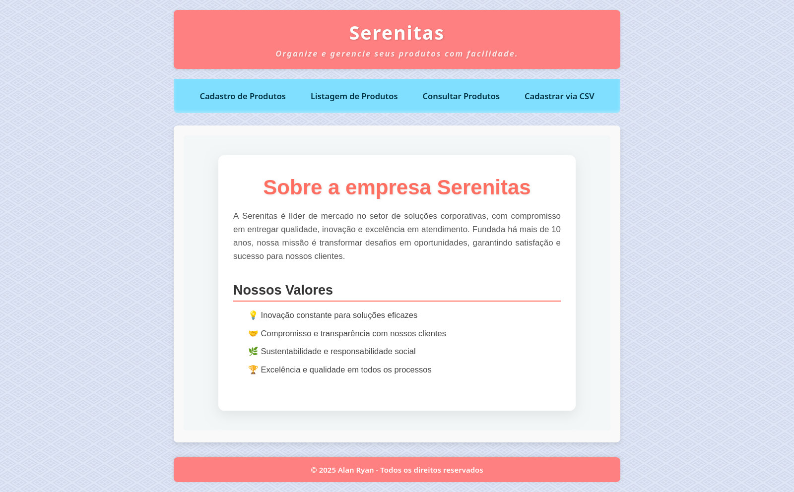

# Serenitas System


<ul>
  <li><h3><i>Página principal do projeto:</i></h3></li>
</ul>



## 🚀 Começando

<div align="center">

### Pré-requisitos


- Java JDK 8 ou superior
- [Apache Ant](https://ant.apache.org/)
- [Apache Tomcat 9 ou 10](https://tomcat.apache.org/)
- MySQL / MariaDB
- Editor como VS Code, NetBeans ou IntelliJ
- Vim

</div>

---

## 📦 Instalação

Para executar localmente, siga os seguintes passos:

1.  **Clone o repositório:**

    ```bash
    git clone https://github.com/0nF1REy/serenitas-system.git
    ```

2.  **Entre no diretório:**

    ```bash
    cd serenitas-system
    ```

3.  **Importe o banco de dados:** 

    ```bash
    # Exemplo com MySQL:
    mysql -u root -p < database/serenitas.sql
    ```

4.  **Compilar e Empacotar o Projeto:** 

    ```bash
    ant clean dist
    ```

5.  **Implantar o WAR no Tomcat:** 

    ```bash
    sudo cp dist/serenitas-system.war /var/lib/tomcat10/webapps/
    ```

6.  **Configurar as Variáveis de Ambiente para o Tomcat:** 

    ```bash
    sudo vim /usr/share/tomcat10/bin/setenv.sh
    ```

7.  **Adicionar o seguinte conteúdo ao sh:** 

    ```bash
    # setenv.sh
    while IFS='=' read -r key value
    do
      export "$key"="$value"
    done < /path/to/your/serenitas-system/.env  
    ```

8.  **Salve o arquivo e torne-o executável:** 

    ```bash
    sudo chmod +x /usr/share/tomcat10/bin/setenv.sh
    sudo chown tomcat10:tomcat10 /usr/share/tomcat10/bin/setenv.sh
    ```

9.  **Reiniciar e iniciar o Tomcat:** 

    ```bash
    sudo systemctl restart tomcat10
    sudo systemctl start tomcat10
    ```

10. **Acesse a aplicação no navegador:**

    ```
    http://localhost:8080/serenitas-system/
    ```
    
---

## Autor 🧑🛡️ 

<div align="center">
  <table>
  <tr>
    <td align="center">
      <a href="https://github.com/0nF1REy" target="_blank">
        <br>
          <b>Alan Ryan</b>  
      </a>
    </td>
  </tr>
</table>
</div>

## 📫 Contribuir

Se você deseja contribuir com o projeto, siga os seguintes passos:

1. **Faça um fork** do repositório.

2. **Crie uma branch** com a sua funcionalidade:

   ```bash
   git checkout -b feature/minha-funcionalidade
   ```

3. **Faça as alterações necessárias**.

4. **Faça um commit** com suas alterações:

   ```bash
   git commit -m "Adicionado minha funcionalidade"
   ```

5. **Envie para o repositório remoto**:

   ```bash
   git push origin feature/minha-funcionalidade
   ```

6. **Abra um pull request** para a branch `main` do projeto original.

### Documentações úteis

- **<a href="https://www.atlassian.com/br/git/tutorials/making-a-pull-request" target="_blank">📝 Como criar uma solicitação pull</a>**

- **<a href="https://gist.github.com/joshbuchea/6f47e86d2510bce28f8e7f42ae84c716" target="_blank">💾 Padrão de commit</a>**

## Licença

<a href="./LICENSE" target="_blank"><b>Licença MIT</b></a>